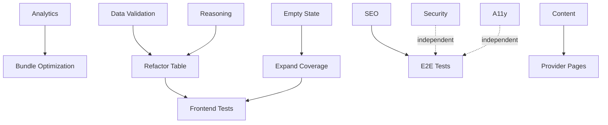

# ProxyPrice Optimization Synthesis

**Date**: 2025-12-28
**Analysts**: PM Agent + Architecture Agent + Orchestrator
**Status**: Ready for Execution

---

## EXECUTIVE SUMMARY

### Combined Assessment

**Product Grade**: B+ (Production-ready MVP with strategic gaps)
**Architecture Grade**: A- (87/100 - Excellent technical foundation)
**Overall Readiness**: ✅ **Ready to Launch** with P0 optimizations

### Critical Insights from PM + Architecture

1. **20.6% Comparable Coverage is THE bottleneck**
   - PM: Limits calculator utility, creates expectation mismatch
   - Arch: Data pipeline is robust but needs estimation logic expansion

2. **Analytics is Blocking Business Validation**
   - PM: Flying blind - can't measure conversion, engagement, or ROI
   - Arch: Easy to add (Umami self-hosted), no architectural changes needed

3. **ComparisonTable Technical Debt Blocks Scale**
   - PM: Works fine now, but need to handle 100+ providers eventually
   - Arch: 127-line inline script prevents testing, reusability, type safety

4. **Calculator UX Needs Trust Building**
   - PM: No explanation of WHY a provider is recommended
   - Arch: Simple to add with existing Preact Signals architecture

---

## PRIORITIZED ACTION PLAN

### P0: Production Blockers (Complete Before Launch - 2 Days)

#### P0-1: Install Analytics & Conversion Tracking

**Owner**: performance-expert + seo-expert
**Effort**: 4 hours
**Impact**: HIGH - Enables all future optimization

**Tasks**:

- [ ] Deploy Umami analytics instance
- [ ] Add tracking script to BaseLayout
- [ ] Instrument calculator usage events
- [ ] Track provider outbound clicks
- [ ] Add UTM parameters to affiliate links

**Files to Modify**:

- `front/src/layouts/BaseLayout.astro` (add Umami script)
- `front/src/components/Calculator.tsx` (add event tracking)
- `front/src/components/ComparisonTable.astro` (track clicks)

---

#### P0-2: Add Runtime Data Validation

**Owner**: code-expert
**Effort**: 3 hours
**Impact**: CRITICAL - Prevents production crashes

**Tasks**:

- [ ] Install Zod for schema validation
- [ ] Create schemas for providers.json and pricing.json
- [ ] Add build-time validation
- [ ] Add descriptive error messages

**Implementation**:

```typescript
// front/src/lib/schemas.ts
import { z } from "zod";

export const ProviderSchema = z.object({
  id: z.string(),
  name: z.string(),
  slug: z.string(),
  cheapest_price_per_gb: z.number().nullable(),
  // ... rest of schema
});

export const validateProviders = (data: unknown) => {
  const result = z.array(ProviderSchema).safeParse(data);
  if (!result.success) {
    throw new Error(`Provider data validation failed: ${result.error}`);
  }
  return result.data;
};
```

---

#### P0-3: Fix Calculator Empty State

**Owner**: ui
**Effort**: 2 hours
**Impact**: HIGH - Reduces 79.4% dead-end rate

**Tasks**:

- [ ] Add "No exact matches" fallback UI
- [ ] Show non-comparable providers as alternatives
- [ ] Add clear explanation and links

**Implementation**:

```tsx
// Calculator.tsx
{
  recommendations.value.length === 0 && (
    <div class="no-results">
      <h4>No exact matches found</h4>
      <p>
        Try adjusting your bandwidth or proxy type. Here are some alternative
        providers:
      </p>
      {/* Show top 5 non-comparable providers */}
    </div>
  );
}
```

---

#### P0-4: Add Recommendation Reasoning

**Owner**: ui
**Effort**: 4 hours
**Impact**: MEDIUM - Builds trust, improves conversion

**Tasks**:

- [ ] Show why each recommendation was chosen
- [ ] Display tier details and alternatives
- [ ] Add "Why this price?" tooltip

**Implementation**:

```tsx
// Calculator.tsx
<div class="rec-meta">
  <div class="rec-reason">✓ Best value for {bandwidth.value}GB tier</div>
  <div class="rec-details">{rec.tierLabel}</div>
</div>
```

---

### P1: UX & Performance (Complete Week 1-2 - 3 Days)

#### P1-1: Refactor ComparisonTable to Preact

**Owner**: code-expert + ui
**Effort**: 6 hours
**Impact**: MEDIUM - Enables testing, improves maintainability

**Tasks**:

- [ ] Extract 127-line inline script to Preact component
- [ ] Convert to TypeScript with proper types
- [ ] Use Preact Signals for state management
- [ ] Add unit tests (Vitest)
- [ ] Maintain URL param synchronization

---

#### P1-2: Expand Comparable Coverage via Estimation

**Owner**: database-design + code-expert
**Effort**: 1 week
**Impact**: HIGH - Increases calculator utility from 20% to 50%+

**Tasks**:

- [ ] Update `normalize.py` with estimation logic
- [ ] For per-IP pricing: estimate $/GB based on average bandwidth
- [ ] Add "Estimated\*" badges to distinguish from exact pricing
- [ ] Update methodology page to explain estimates
- [ ] Add disclaimer tooltips

**Implementation**:

```python
# backend/scripts/normalize.py
def estimate_price_per_gb_from_ip(tier: Dict) -> Optional[float]:
    """Estimate $/GB for per-IP pricing using industry averages"""
    if tier.get('pricing_model') != 'per_ip':
        return None

    # Industry average: ~10GB per residential IP
    avg_gb_per_ip = 10
    price_per_ip = tier.get('price_per_ip')

    if price_per_ip:
        estimated_gb_price = price_per_ip / avg_gb_per_ip
        return round(estimated_gb_price, 2)

    return None
```

---

#### P1-3: Optimize Bundle Size

**Owner**: performance-expert
**Effort**: 4 hours
**Impact**: MEDIUM - Prepare for 100+ providers

**Tasks**:

- [ ] Configure Vite manual chunks
- [ ] Lazy load provider detail pages
- [ ] Add resource hints (preconnect, dns-prefetch)
- [ ] Implement virtual scrolling in ComparisonTable (if needed)

---

#### P1-4: Add Frontend Testing

**Owner**: test-expert
**Effort**: 8 hours
**Impact**: MEDIUM - Enables confident refactoring

**Tasks**:

- [ ] Install Vitest + @testing-library/preact
- [ ] Add tests for Calculator component
- [ ] Add tests for ComparisonTable (after refactor)
- [ ] Target 80% coverage for components
- [ ] Add CI integration

---

### P2: Content & SEO (Parallel Track - Week 2-3)

#### P2-1: SEO Enhancements

**Owner**: seo-expert + pseo-strategist
**Effort**: 2 days
**Impact**: HIGH - Organic traffic growth

**Tasks**:

- [ ] Enhance meta descriptions (more specific per page)
- [ ] Add FAQ schema to relevant pages
- [ ] Improve internal linking structure
- [ ] Add breadcrumbs to all pages
- [ ] Create content hub structure (blog pages)

---

#### P2-2: Content Quality Improvements

**Owner**: content
**Effort**: 3 days
**Impact**: MEDIUM - Trust building, SEO

**Tasks**:

- [ ] Expand About page (mission, team, data sources)
- [ ] Enhance Methodology page (more examples, visuals)
- [ ] Add FAQ section to homepage
- [ ] Create "How to Choose a Proxy" guide
- [ ] Add provider use case descriptions

---

#### P2-3: Rich Provider Pages

**Owner**: content + ui
**Effort**: 1 week
**Impact**: MEDIUM - Competitive parity

**Tasks**:

- [ ] Add pros/cons sections to provider pages
- [ ] Add use case descriptions
- [ ] Improve CTA section with value props
- [ ] Add "Featured Provider" badges (if partnerships exist)
- [ ] Add comparison matrix vs alternatives

---

### P3: Security & Quality (Parallel Track - Week 2-3)

#### P3-1: Security Audit

**Owner**: security-auditor
**Effort**: 1 day
**Impact**: LOW - Preventive

**Tasks**:

- [ ] Verify CSP headers in \_headers file
- [ ] Add SRI for external scripts (when added)
- [ ] Security scan with npm audit
- [ ] Review for XSS vulnerabilities
- [ ] Add security.txt file

---

#### P3-2: E2E Testing

**Owner**: test-expert
**Effort**: 2 days
**Impact**: MEDIUM - Regression prevention

**Tasks**:

- [ ] Install Playwright
- [ ] Add tests for critical user journeys:
  - Homepage → Calculator → Results → Provider
  - Homepage → Residential → ComparisonTable → Filter → Provider
  - Direct provider page load
- [ ] Add visual regression tests
- [ ] Add accessibility tests (axe-core)

---

#### P3-3: Accessibility Improvements

**Owner**: ui + test-expert
**Effort**: 1 day
**Impact**: MEDIUM - Compliance, UX

**Tasks**:

- [ ] Run axe-core accessibility audit
- [ ] Add ARIA labels where missing
- [ ] Verify keyboard navigation works
- [ ] Check color contrast ratios
- [ ] Add skip links (already exists, verify)
- [ ] Test with screen readers

---

## PARALLEL EXECUTION STRATEGY

### Track 1: Critical Functionality (P0)

**Duration**: 2 days
**Agents**: code-expert, performance-expert, ui
**Deliverables**:

- Analytics installed and tracking
- Data validation added
- Calculator empty state fixed
- Recommendation reasoning added

### Track 2: Performance & Testing (P1)

**Duration**: 1 week
**Agents**: code-expert, test-expert, performance-expert
**Deliverables**:

- ComparisonTable refactored
- Frontend tests added (80% coverage)
- Bundle optimized
- Comparable coverage expanded

### Track 3: Content & SEO (P2)

**Duration**: 1 week (parallel with Track 2)
**Agents**: content, seo-expert, pseo-strategist
**Deliverables**:

- Enhanced meta descriptions
- FAQ schema added
- Content hub structure created
- Provider pages enriched

### Track 4: Security & Quality (P3)

**Duration**: 3 days (parallel with Track 2)
**Agents**: security-auditor, test-expert
**Deliverables**:

- Security audit complete
- E2E tests added
- Accessibility score 95+

---

## SUCCESS METRICS

### Performance

- [ ] Build time remains < 1s
- [ ] Bundle size < 1.5MB (or < 2MB with analytics)
- [ ] Lighthouse Performance 95+
- [ ] Lighthouse SEO 100
- [ ] Lighthouse Accessibility 95+

### Functionality

- [ ] All 11 backend tests passing
- [ ] All new frontend tests passing
- [ ] 0 TypeScript errors
- [ ] 0 console errors in production
- [ ] Calculator works with 50%+ of providers (up from 20.6%)

### User Experience

- [ ] Analytics tracking all key events
- [ ] Calculator shows recommendations reasoning
- [ ] Empty states have helpful fallbacks
- [ ] Provider pages have rich content
- [ ] Mobile navigation improved

### SEO & Content

- [ ] All pages have unique meta descriptions
- [ ] FAQ schema implemented
- [ ] Internal linking optimized
- [ ] Content hub structure created

### Security & Quality

- [ ] Security audit passed
- [ ] E2E tests covering critical paths
- [ ] Accessibility score 95+
- [ ] No known vulnerabilities

---

## RISK MITIGATION

| Risk                         | Probability | Impact | Mitigation                                        |
| ---------------------------- | ----------- | ------ | ------------------------------------------------- |
| Analytics slows page load    | Low         | Medium | Use lightweight Umami, async loading              |
| Data validation breaks build | Low         | High   | Add graceful degradation, detailed error messages |
| Estimation logic inaccurate  | Medium      | Medium | Add large disclaimers, conservative estimates     |
| Refactor introduces bugs     | Medium      | High   | Comprehensive testing before merge                |
| Content changes hurt SEO     | Low         | High   | Test on staging, monitor Search Console           |

---

## DEPENDENCIES & ORDERING



---

## TIMELINE ESTIMATE

**Total Time**: 2-3 weeks for complete optimization

- **Week 1, Days 1-2**: P0 items (Critical functionality)
- **Week 1, Days 3-5**: P1 Track 1 (Performance & Testing)
- **Week 2, Days 1-5**: P1 Track 2 + P2 (Content & SEO) - parallel
- **Week 2, Days 1-3**: P3 (Security & Quality) - parallel
- **Week 3**: Integration, testing, final validation

**Quality Focus**: No shortcuts, production-ready code only

---

## NEXT STEPS

1. **Immediate**: Start P0 Track (analytics, validation, empty states)
2. **Day 3**: Begin parallel P1 and P2 tracks
3. **Weekly**: Integration checkpoints, resolve conflicts
4. **Week 3**: Final validation, deployment preparation

**Execution Mode**: Maximum parallel efficiency while maintaining quality
